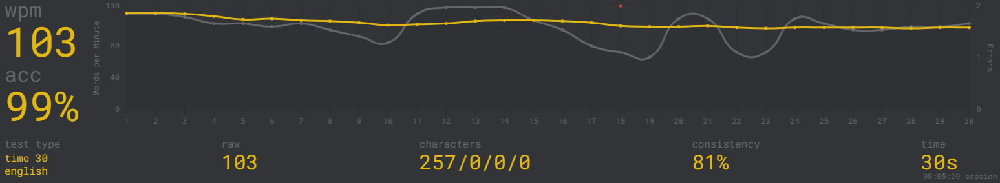

# Ribyns Environment

My personalized environment for Arch Linux, Fedora, Neovim, WSL and many other things.


## Arch

`git clone ssh://git@codeberg.com:Ribyn/ribyns-env.git $HOME/ribyns-env`

if zsh is not yet synced, ake sure to export the `RIBYNS_ENV` environment variable before running any scripts:
`export RIBYNS_ENV="$HOME/ribyns-env"`

> if zsh is already installed, .zshrc exports this variable

Run the install script:
`~/ribyns-env/scripts/install.sh --pacman`


## Terminal

### Emulator

using `kitty`

on arch build from source (e.g. `yay wezterm-git`)

install the font commit-mono `yay extra/oft-commit-mono-nerd`
choose the nerd one `otf-commit-mono-nerd`

## Notes on easy to forget keybinds

`CTRL+e` to accept ghost-like zsh-autosuggestions

## WSL

**Wezterm**
Terminal Emulator is `wezterm`. Since kitty is not supported.
The font needs to be installed on windows to be available for wezterm
on windows just go to the [website.org](https://wezterm.org) and download it.

**Neovim**
nvim path `%AppData%/local/nvim`
but Telescope and maybe other features using the Linux ecosystem do not work.

### Scripts

the `scripts` directory is added to the `$PATH`,
and therefore can be invoked using their filename.
e.g. `install.sh --pacman`

### MonkeyType 

100% acc


<100% acc


---

```
Sat Jun 20 11:21:42 PM CEST 2026
━━━━━━━━━━━━━━━━━━━━━━━━━━━━━━━━━━━━━━━━━━━━━━━━━━━━━━━━━━━━━━━━━━━━━━━━━━━━━━━━━
 Language              Files        Lines         Code     Comments       Blanks
━━━━━━━━━━━━━━━━━━━━━━━━━━━━━━━━━━━━━━━━━━━━━━━━━━━━━━━━━━━━━━━━━━━━━━━━━━━━━━━━━
 BASH                     16          734          527           75          132
 Batch                     1           10            4            4            2
 CSS                       1           26           26            0            0
 INI                       1           18            5            9            4
 JSON                      1           53           53            0            0
 Lua                      36         2569         1893          455          221
 Rusty Object Nota|        2          568          568            0            0
 Shell                    66         2120         1358          394          368
 TOML                      5         1863         1673           98           92
 Zsh                       1         1720          443         1103          174
─────────────────────────────────────────────────────────────────────────────────
 Markdown                 20         1369            0         1020          349
 |- BASH                   5           12            9            2            1
 (Total)                             1381            9         1022          350
━━━━━━━━━━━━━━━━━━━━━━━━━━━━━━━━━━━━━━━━━━━━━━━━━━━━━━━━━━━━━━━━━━━━━━━━━━━━━━━━━
 Total                   150        11062         6559         3160         1343
━━━━━━━━━━━━━━━━━━━━━━━━━━━━━━━━━━━━━━━━━━━━━━━━━━━━━━━━━━━━━━━━━━━━━━━━━━━━━━━━━
```
