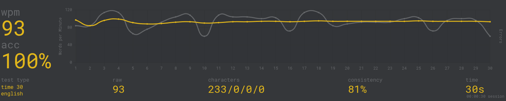
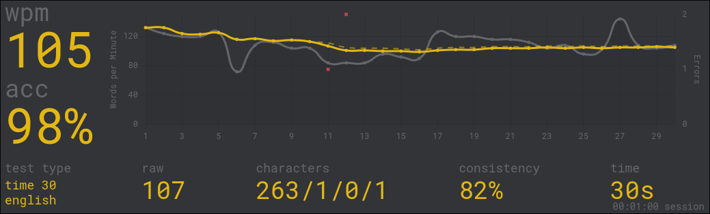

# Ribyns Environment

My personalized environment for Arch Linux, Fedora, Neovim, WSL and many other things.


[gourced full history](./gourced.md)

> checkout [installers and helpers](./installers.md) for first time clones / installs

## Git Revisions

if you want to override values locally (per machine) use your zshrc local
located in ~/.config/ribyn/zsh/local.sh

when using branches for GIT_REV always include the remote prefix: `origin/<branch>`
it seems redundant, becuase its always origin/ for branches, but currently our script
has not way of telling,
if the GIT_REV is a hash, tag or branch
specifying a branch, also enabled auto updating. Otherwise choose a commit or tag.
a tag can be updated by the maintainers, and can cause a unpredictable update.
(and commits can be lost, if the maintainers decide to get rid of it)

## Syncing config files with rsync

```sh
# --recursive, -r          recurse into directories
# --links, -l              copy symlinks as symlinks
# --perms, -p              preserve permissions
# --times, -t              preserve modification times
# --verbose, -v
```

## Setup remotes

when cloning from gh

```sh
cd "$RIBYN_ROOT"
git remote rename origin gh
git remote add cb ssh://git@codeberg.org/Ribyn/ribynlinux.git
git config remotes.all "gh cb"
```

## generating ssh key

```sh
# recommended
ssh-keygen -t ed25519 -C "your-comment"
# optinally older key
ssh-keygen -t rsa -b 4096 -C "your-comment"

ssh-keyscan -H github.com >>~/.ssh/known_hosts
ssh-keyscan -H codeberg.org >>~/.ssh/known_hosts
```

## MonkeyType 

100% acc


<100% acc


```sh
Sun Sep 20 12:50:51 PM CEST 2026
━━━━━━━━━━━━━━━━━━━━━━━━━━━━━━━━━━━━━━━━━━━━━━━━━━━━━━━━━━━━━━━━━━━━━━━━━━━━━━━━━
 Language              Files        Lines         Code     Comments       Blanks
━━━━━━━━━━━━━━━━━━━━━━━━━━━━━━━━━━━━━━━━━━━━━━━━━━━━━━━━━━━━━━━━━━━━━━━━━━━━━━━━━
 BASH                     17          557          390           77           90
 Batch                     1           10            4            4            2
 CSS                       2          212          173            5           34
 Forge Config              1           36           29            0            7
 INI                       2           21            8            9            4
 JavaScript                4         1659          516          860          283
 JSON                      3         1910         1910            0            0
 Lua                      74         5212         3621         1072          519
 Rusty Object Nota|        2          526          526            0            0
 Shell                   162         4941         3191          945          805
 TOML                     10         2425         1916          303          206
 YAML                      1          273          172           63           38
 Zsh                       1         1720          443         1103          174
─────────────────────────────────────────────────────────────────────────────────
 Markdown                 48         3244            0         2441          803
 |- BASH                   7           49           30           13            6
 (Total)                             3293           30         2454          809
━━━━━━━━━━━━━━━━━━━━━━━━━━━━━━━━━━━━━━━━━━━━━━━━━━━━━━━━━━━━━━━━━━━━━━━━━━━━━━━━━
 Total                   328        22795        12929         6895         2971
━━━━━━━━━━━━━━━━━━━━━━━━━━━━━━━━━━━━━━━━━━━━━━━━━━━━━━━━━━━━━━━━━━━━━━━━━━━━━━━━━
```

> interstingly since Sat Jun 20 11:21:42 PM CEST 2026
the amount of bash files +1, comment lines +2, lines -200~, code -140~
and blank very largely reduced while new features where being added.
