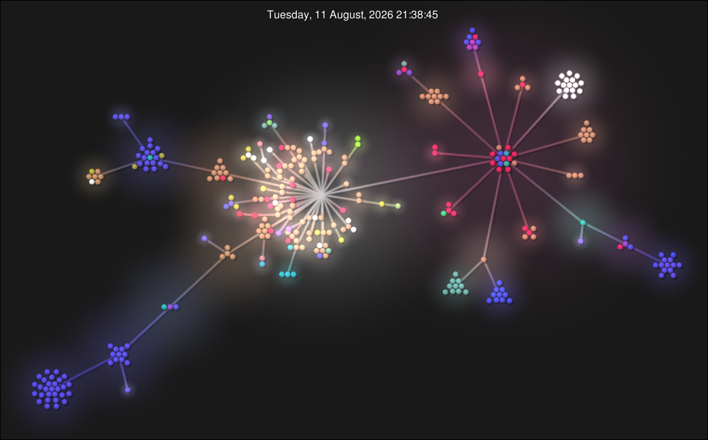
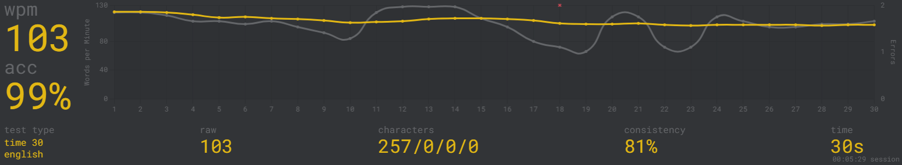

# Ribyns Environment

My personalized environment for Arch Linux, Fedora, Neovim, WSL and many other things.


[gourced full history](./gourced.md)

> checkout [installers and helpers](./installers.md) for first time clones / installs


## MonkeyType 

100% acc


<100% acc


```
Sat Jun 20 11:21:42 PM CEST 2026
━━━━━━━━━━━━━━━━━━━━━━━━━━━━━━━━━━━━━━━━━━━━━━━━━━━━━━━━━━━━━━━━━━━━━━━━━━━━━━━━━
 Language              Files        Lines         Code     Comments       Blanks
━━━━━━━━━━━━━━━━━━━━━━━━━━━━━━━━━━━━━━━━━━━━━━━━━━━━━━━━━━━━━━━━━━━━━━━━━━━━━━━━━
 BASH                     16          734          527           75          132
 Batch                     1           10            4            4            2
 CSS                       1           26           26            0            0
 INI                       1           18            5            9            4
 JSON                      1           53           53            0            0
 Lua                      36         2569         1893          455          221
 Rusty Object Nota|        2          568          568            0            0
 Shell                    66         2120         1358          394          368
 TOML                      5         1863         1673           98           92
 Zsh                       1         1720          443         1103          174
─────────────────────────────────────────────────────────────────────────────────
 Markdown                 20         1369            0         1020          349
 |- BASH                   5           12            9            2            1
 (Total)                             1381            9         1022          350
━━━━━━━━━━━━━━━━━━━━━━━━━━━━━━━━━━━━━━━━━━━━━━━━━━━━━━━━━━━━━━━━━━━━━━━━━━━━━━━━━
 Total                   150        11062         6559         3160         1343
━━━━━━━━━━━━━━━━━━━━━━━━━━━━━━━━━━━━━━━━━━━━━━━━━━━━━━━━━━━━━━━━━━━━━━━━━━━━━━━━━
```

